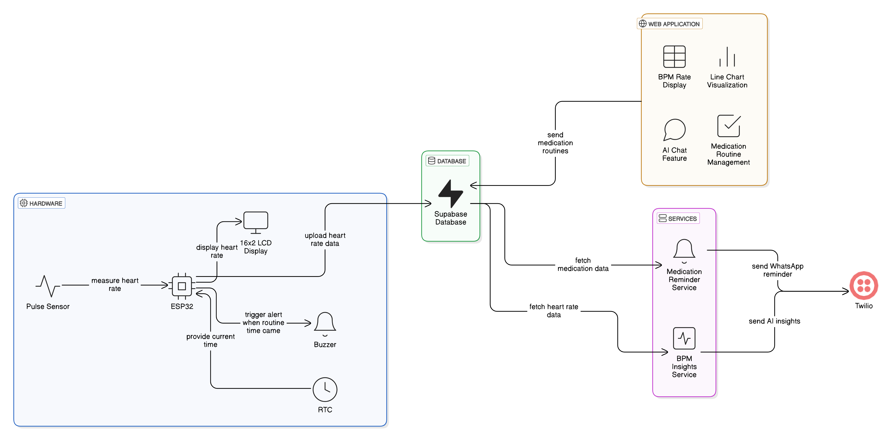

## BodySQL - Disrupting Healthcare, One Hot Dog at a Time 🌭

BodySQL is a healthcare monitoring and management system that built for Fundamental of Computing(IT1140) Mini Project Assignment.



## How It Works:

- Heart Rate Monitoring: A pulse sensor measures the heart rate and sends the data to an ESP32 microcontroller, which displays it on a 16x2 LCD and stores it in a Supabase database.

- Web Application: The web app fetches heart rate data from Supabase to display BPM rates and visualize them on a line chart. It also includes an AI chat feature for health-related queries and a medication routine management system.

- Medication Reminders: The system fetches medication data from Supabase. When it's time for medication, the ESP32 activates a buzzer and sends a WhatsApp message via Twilio.

- BPM Insights: Every 10 minutes, the system collects BPM data and sends AI insights to the user via WhatsApp using Twilio.

## Prerequisites

Before you start, make sure you have this hardware and softwares

#### Hardware Components

- ESP32 microcontroller
- Pulse sensor
- Piezo buzzer
- RTC
- 16x2 i2C LCD display
  -- i will update the arduino diagram soon.

#### Software Component

- Choreo Account - Sign up for a Choreo account(console.choreo.dev) to integrate and deploy services efficiently.
- Twilio Account - Create a Twilio Account for to to setup schedule task
- Supabase Database - We are using supabase as a database for this project, soo goo an set up it also

You must understand how to setup softwares on your computer/web. If you do not know how to do this, please ask someone at your office, school, etc. or pay someone to explain this to you. The Maven mailing lists are not the best place to ask for this advice.

#### Install dependencies

You will need to install and configure the following dependencies on your machine to build this:

- Git
- Node.js v20.x (LTS)
- Arduino

## Run Locally

This repository is structured as follows:

IT1140-P22
├── docs
├── ino
├── schedule-tasks
│ ├── bpm-reminder
│ └── medication-reminder
└── webapp

First forked this project and clone it in to your machine

```bash
  git clone https://github.com/<github_username>/IT1140-P22
```

now let's go confugure and run each services.

1. Web Application

Go to the /webapp directory

```bash
  cd IT1140-P22/webapp
```

Install dependencies

```bash
  npm install
```

To run this webapp, you will need to add the following environment variables to your public/config.js file

```JS
window.configs = {
  supabaseUrl: "Your Supabase URL",
  supabaseKey: "Your Supabase Anon key",
  mistralApiKey: "Mistral PAI",
};
```

first you need to create a new supabase project and obtain the `API KEY` and `SUPABASE URL`. then create these tables, make sure add that `API KEY` and `Supabase URL` to the `config.js` file.

```SQL
-- Table: health_conditions
CREATE TABLE health_conditions (
    id SERIAL PRIMARY KEY,        -- Unique ID for the health condition
    created_at TIMESTAMPTZ DEFAULT NOW(), -- Timestamp of creation
    condition_name TEXT NOT NULL  -- Name of the health condition
);

-- Table: bpm_readings
CREATE TABLE bpm_readings (
    id SERIAL PRIMARY KEY,        -- Unique ID for the reading
    created_at TIMESTAMPTZ DEFAULT NOW(), -- Timestamp of the reading
    bpm INT NOT NULL              -- Beats per minute value
);

-- add some mock BPM rate to the database to check is it working on the database

-- Table: medications
CREATE TABLE medications (
    id SERIAL PRIMARY KEY,        -- Unique ID for the medication entry
    created_at TIMESTAMPTZ DEFAULT NOW(), -- Timestamp of creation
    medication_name TEXT NOT NULL, -- Name of the medication
    dosage TEXT NOT NULL,         -- Dosage instructions
    frequency TEXT NOT NULL,      -- Frequency of the medication
    start_date DATE NOT NULL,     -- Start date for the medication
    end_date DATE,                -- End date for the medication (optional)
    condition_id INT REFERENCES health_conditions(id) ON DELETE SET NULL, -- Foreign key to health_conditions
    time TIME NOT NULL,           -- Time to take the medication
    condition_name TEXT           -- Name of the associated condition (redundant if using condition_id)
);

```

after completing the supabase environment you need to obtain a MISTRAL AI `API KEY`, you can get to from their console(console.mistral.ai). add that key also to the `config.js`.

Finally , Start the server running, you can see beautiful dashboard in `http://localhost:5173/`

```bash
  npm run dev
```

2. BPM Reminder

in this simple javascript service we're doing, fetch the data from the our database, `bpm_readings` table and send the last 5 data with a AI Insights using whatsapp, to send whatsapp message we use Twilio.

soo you need to create a twilio account and configure your whatsapp account with twilio and obtain `API KEY` `ACC SID` and `Twilio Whatsapp Number`. get some help from perplexity to do this step.

Then. Go to the schedule-task/bpm-reminder directory

```bash
  cd schedule-task/bpm-reminder directory
```

Install dependencies

```bash
  npm install
```

create a `.env` file and add those values we obtain in the Web App part.

```bash
SUPABASE_URL;
SUPABASE_KEY;
MISTRAL_API_KEY;
TWILIO_ACC_SID;
TWILIO_AUTH_TOKEN;
TWILIO_WHATSAPP_NUM;
```

3. Medication Reminder

This service also same as BPM reminder service,but the function is different, here we fetch the medications data from the database, and if any of the time in that table is match with the current time this send a whatsapp message to the user reminding the medication /w dosage.

do the same step we did in the BPM Reminder service to configure this service also, except the Mistral AI Part.

4. Ino
   heres our arduino program in, and for this project i used Arduino IDE, So copy the code from the main.ino and pasted in your new sketch in arduino ide and add those API Keys and URLS.

```c++
const char *ssid = "Your WiFi ID";
const char *password = "Password";

const char *supabaseUrl = "Supabase URL";
const char *supabaseKey = "Supabase Anon Key";
const char *tableName = "bpm_readings";
```

thats it, and after i got a time to draw the arduino diagram, i will explain how this works.
